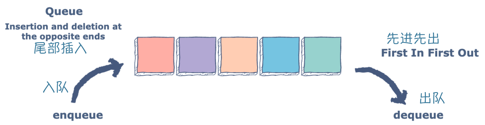

# Queues 队列

队列是一种特殊的线性表，特殊之处在于它只允许在表的前端（front）进行删除操作，而在表的后端（rear）进行
插入操作也称 FiFo 队列(First in First out), 可以在队列上执行入队，出队和查看等操作。队列通常用于存储
需要完成的任务或需要由服务器处理的传入 HTTP 请求。队里可以使用数组或者单链表来实现。 在现实生活中，
处理实时系统中的中断调用处理和 CPU 任务调度是使用队列的良好示例。在 go 中可以通过切片和链表来实现队列



## 切片实现队列

append 内置函数会在切片的尾部进行增加。用来模拟入队操作。出队的原理可以在 slice 的基础上 reslice 返回
除第一个元素的 slice。

``` GO
// 入队
func enqueue(queue []int, element int) []int {
	// append 添加至切片的尾部
	queue = append(queue, element)
	fmt.Println("Enqueued:", element)
	return queue
}

// 出队
func dequeue(queue []int) []int {
	// 第一个元素出队
	element := queue[0]
	fmt.Println("Dequeued:", element)
	// 在原slice上reslice,返回除第一个元素后的切片
	return queue[1:]
}
```

* 输出

``` GO
func main() {
	var queue []int // Make a queue of ints.

	queue = enqueue(queue, 10)
	queue = enqueue(queue, 20)
	queue = enqueue(queue, 30)

	fmt.Println("Queue:", queue)

	queue = dequeue(queue)
	fmt.Println("Queue:", queue)

	queue = enqueue(queue, 40)
	fmt.Println("Queue:", queue)
}

--- output:
Enqueued: 10
Enqueued: 20
Enqueued: 30
Queue: [10 20 30]
Dequeued: 10
Queue: [20 30]
Enqueued: 40
Queue: [20 30 40]
```

> 内存泄漏问题：这样看似很简单的实现了队里，但是存在一个问题就是在出队的函数中永远不会返回切片的第一
> 个元素的内存造成内存泄漏。

* [练习订单队列](./example_01/main.go)

## 链表实现队列

我们可以使用动态数据结构链接以避免内存泄漏。这里就不重新实现一个链表了，我们可以使用 go 提供的标准库
`container/list` 包提供的链表。

``` go
func ListQueue() {
	queue := list.New()

	// pushBack方法会添加到链表的尾部
	queue.PushBack(10)
	queue.PushBack(20)
	queue.PushBack(30)

	// Front会得到当前链表的头部
	front := queue.Front()
	fmt.Println(front.Value)
	// remove将删除分配的内存并避免内存泄漏
	queue.Remove(front)
}
```
