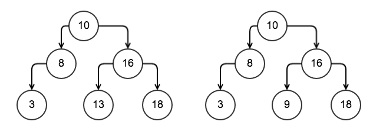

## Tree 树

树是一种非线性数据结构。 树用于搜索和其他用例。 二叉树的节点最多有两个子节点。 二叉搜索树由左侧节点的
属性值小于右侧节点的属性值的节点组成。 根节点位于树的零级。 每个子节点可以是叶。没有节点的树被称为空树

## Binary search tree 二叉搜索树

二叉搜索树是一种允许快速查找、添加和删除元素的数据结构。 它按排序顺序存储密钥，以实现更快的查找。 这
种数据结构是由 P.F.Windley、A.D.Booth、A.J.T.Colin 和 T.N.Hibbard 发明的。平均而言，二叉树的空间复杂
度为 O(N)，而插入、搜索和删除操作为 O(Logn)。



二叉搜索树由具有属性或属性的节点组成：

- key 整形
- value 整形
- 树的左右节点 leftNode 和 rightNode

一个树节点：

```GO
// TreeNode
type TreeNode struct {
    key int
    value int
    leftNode *TreeNode
    rightNode *TreeNode
}
```

二叉搜索树 BinarySearchTree 由 TreeNode 类型的 rootNode 和 sync.RWMutex 类型的 lock 组成。 通过访问
rootNode 左侧和右侧的节点，可以从 rootNode 遍历二叉搜索树：

```GO
// BinarySearchTree
type BinarySearchTree struct {
  // 根节点
  rootNode *TreeNode
  lock sync.RWMutex
}
```
