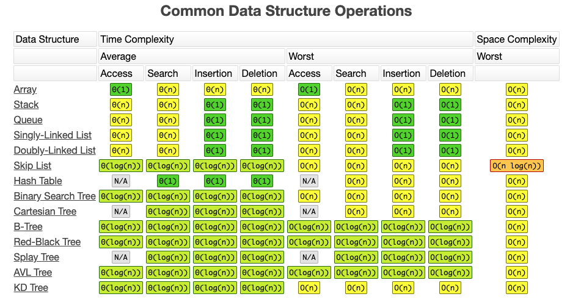

# DataStructures and Algorithms Go

## 阅读

在线阅读你可以通过 blog 或者在线图书 gitbook 得到更好的阅读体验

- gitbook: https://book.gopherhub.org
- blog : https://blog.gopherhub.org

## 数据结构分类

下图展示了基础的数据结构的分类:

## 数据结构操作的时间复杂度和空间复杂度

## 目录

- 数据结构
  - [Chapter1 线性数据结构](/DataStructures/Chapter1-Linear/)
    - [01- Lists 链表](/DataStructures/Chapter1-Linear/01-Lists/)
      - [SinglyLinkedList 单链表](/DataStructures/Chapter1-Linear/01-Lists/01-SinglyLinkedList/SinglyLinkedList.md)
      - [DoublyLinkedList 双链表](/DataStructures/Chapter1-Linear/01-Lists/02-DoublyLinkedList/DoublyLinkedList.md)
      - [CircularLinkedList 环形链表](/DataStructures/Chapter1-Linear/01-Lists/03-CircularLinkedList/CircularLinkedList.md)
    - [02- Sets 集合](/DataStructures/Chapter1-Linear/02-sets/)
      - [Sets 集合](/DataStructures/Chapter1-Linear/02-sets/sets.md)
    - [03- Queues 队列](/DataStructures/Chapter1-Linear/03-Queues/)
      - [Queues 队列](/DataStructures/Chapter1-Linear/03-Queues/queues.md)
  - [Chapter2 非线性](/DataStructures/Chapter2-Non-Linear/)
    - [Trees 树](/DataStructures/Chapter2-Non-Linear/Trees/)
  - Chapter3 同构

## 注

- 图片素材来源于网络侵删
